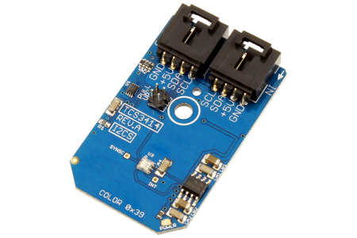

[](https://www.controleverything.com/content/Color?sku=TCS3414_I2CS)
# TCS3414
TCS3414 Color Light-to-Digital Converter

The TCS3414 provides color and IR (red, green, blue, clear and IR) light sensing using I²C communications.

This Device is available from ControlEverything.com [SKU: TCS3414_I2CS]

https://www.controleverything.com/content/Color?sku=TCS3414_I2CS

This Sample code can be used with Raspberry pi and Arduino.

## Java
Download and install pi4j library on Raspberry pi. Steps to install pi4j are provided at:

http://pi4j.com/install.html

Download (or git pull) the code in pi.

Compile the java program.
```cpp
$> pi4j TCS3414.java
```

Run the java program.
```cpp
$> pi4j TCS3414
```

## Python
Download and install smbus library on Raspberry pi. Steps to install smbus are provided at:

https://pypi.python.org/pypi/smbus-cffi/0.5.1

Download (or git pull) the code in pi. Run the program.

```cpp
$> python TCS3414.py
```

## Arduino
Download and install Arduino Software (IDE) on your machine. Steps to install Arduino are provided at:

https://www.arduino.cc/en/Main/Software

Download (or git pull) the code and double click the file to run the program.

Compile and upload the code on Arduino IDE and see the output on Serial Monitor.

#####The code output is the lux value of IR , RGB and total luminance.
